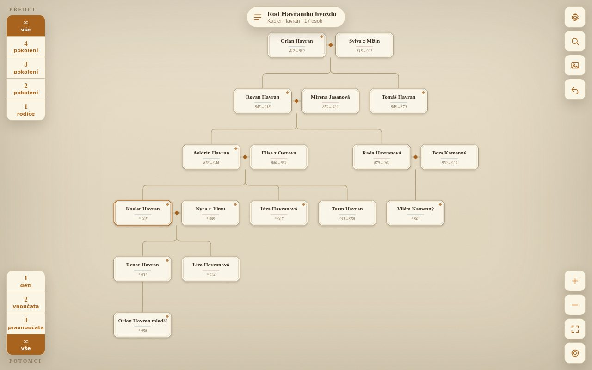
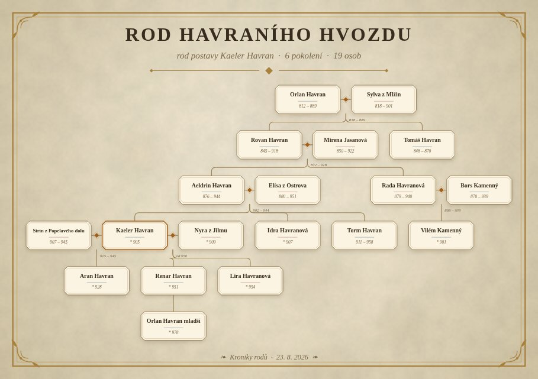

# Kroniky rodů

Webová aplikace pro tvorbu **rodokmenů postav ve fantasy světech**. Běží celá
v prohlížeči, nic se nikam neodesílá a hotový strom se dá uložit jako obrázek
ve formátu A5 nebo A4 — tak, aby se dal vložit do knihy nebo herního manuálu.

| Aplikace | Vyexportovaná stránka |
| --- | --- |
|  |  |

## Co aplikace umí

- **Neomezeně rodů** — pro každou postavu vlastní strom, mezi stromy se
  přepíná v nabídce nahoře.
- **Neomezená hloubka předků i potomků.** Strom se počítá vždy kolem jedné
  „zaměřené" postavy; kterákoli osoba se dá zaměřit a strom se rozvine kolem ní.
- **Volba pokolení.** Vlevo nahoře se nastaví, kolik pokolení předků se
  zobrazí (1–4 nebo vše), vlevo dole totéž pro potomky (děti, vnoučata,
  pravnoučata, vše). Karty osob, jejichž příbuzní jsou právě skryti, mají
  značku `▲ 2` / `▼ 3` — klepnutím na ni se strom rozvine kolem nich.
- **Větvení a proplétání.** Vazby se drží ve *svazcích*, takže jedna osoba může
  být partnerem ve více svazcích, děti mohou být z různých svazků a dvě
  samostatně založené větve rodu se dají kdykoli propojit (`Propojit`) nebo
  rozpojit (`Odpojit`).
- **U každé osoby**: jméno, pohlaví, rok narození a úmrtí (volný text, klidně
  „3. věk, 244") a poznámka.
- **Export obrázku** — A5 nebo A4, 300 DPI, na výšku i na šířku, v provedení
  *Pergamen* nebo *Inkoust*. Orientaci i rozestupy pokolení aplikace volí sama
  tak, aby jména byla co největší; pokud by přesto vyšla drobná, upozorní na to.
- **Zálohy** — všechny rody se dají uložit do jednoho souboru JSON a zase načíst
  (přenos mezi počítači, sdílení se spoluautory).

## Spuštění

Stačí otevřít `index.html` v prohlížeči (Chrome, Firefox, Safari, Edge).
Aplikace nepotřebuje žádnou instalaci ani připojení k internetu.

Pro přenášení na flash disku nebo posílání e-mailem se hodí jednosouborová
verze — všechny styly i skripty jsou vložené uvnitř:

```sh
node build.js     # → dist/kroniky-rodu.html
```

Pokud chcete mít jistotu, že prohlížeč povolí ukládání dat, spusťte ji přes
jednoduchý lokální server:

```sh
python3 -m http.server 8000
# a otevřete http://localhost:8000
```

Obsah repozitáře jde také nahrát na GitHub Pages nebo jiný statický hosting —
je to čistě HTML, CSS a JavaScript bez sestavovacího kroku.

## Ovládání

| Akce | Jak |
| --- | --- |
| Nabídka osoby | klepnutí na kartu → kruhová nabídka |
| Zaměřit osobu | dvojklik na kartu nebo `Zaměřit` v nabídce |
| Posun / přiblížení | tažení myší, kolečko, na dotyku dva prsty |
| Zpět na předchozí zaměření | `Backspace` |
| Hledat osobu | `F` |
| Rody a stromy | `T` |
| Obrázek rodokmenu | `E` |
| Celý strom do okna | `0`, na zaměřenou osobu `C` |
| Zpět / znovu | `Ctrl+Z` / `Ctrl+Shift+Z` |
| Upravit vybranou osobu | `Enter` |

Kde se data ukládají: v úložišti prohlížeče (`localStorage`) na tomto počítači.
Před přeinstalací systému nebo při přechodu na jiný počítač si udělejte zálohu
přes **Nastavení → Zálohovat vše (JSON)**.

## Struktura kódu

```
index.html        kostra stránky a lišty
css/styles.css    vzhled (dva motivy: Pergamen, Inkoust)
js/store.js       datový model, vazby mezi osobami, ukládání, zpět/znovu
js/layout.js      výpočet rozvržení stromu (viditelnost, rozmístění, rozestupy)
js/view.js        vykreslení do SVG, posun, přiblížení, výběr karet
js/ui.js          dialogy, formuláře, kruhová nabídka, správa rodů
js/export.js      vykreslení stránky kroniky do obrázku (pergamen, rám, strom)
js/files.js       ukládání souborů (odkaz ke stažení, případně hostitel)
js/app.js         propojení všech částí, klávesové zkratky, ukázkový rod
build.js          sestavení jednosouborové verze do dist/
```

Datový model stojí na *svazcích*: osoba (`person`) má jméno a údaje, svazek
(`union`) drží partnery a jejich děti. Rodičovská vazba je odkaz dítěte na
svazek. Díky tomu jde bez problémů podchytit druhá manželství, nevlastní
sourozence i sňatky mezi větvemi téhož rodu.

Rozvržení se počítá ve třech krocích: nejdřív se určí, které osoby jsou při
zvolené hloubce vidět, pak se rekurzivně rozmístí podstromy (s obrysovým
balením, aby se větve nepřekrývaly), a nakonec proběhne kontrola rozestupů
v každém pokolení.
